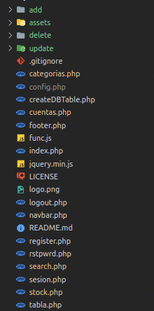

<!-----
Conversion notes:

* Docs to Markdown version 1.0β31
* Sun Dec 19 2021 07:11:52 GMT-0800 (PST)
* Source doc: Conga - Tesis
* Tables are currently converted to HTML tables.

ERROR:
undefined internal link to this URL: "#heading=h.dv6no1wi2ckh".link text: 8.5.4
?Did you generate a TOC?


ERROR:
undefined internal link to this URL: "#heading=h.nf5i617q92d".link text: Ver 8.5.5
?Did you generate a TOC?


ERROR:
undefined internal link to this URL: "#heading=h.2ghdjbjfja5q".link text: Ver 8.5.6
?Did you generate a TOC?


ERROR:
undefined internal link to this URL: "#heading=h.c966mb8faf7l".link text: sección 8.5.8
?Did you generate a TOC?


ERROR:
undefined internal link to this URL: "#heading=h.epp9864uv7pz".link text: sección 8.5.2
?Did you generate a TOC?


----->


# 


# ConGa


# Sistema web para 


# control de gastos domésticos

Autor: Andres Muñoz

Tabla de contenido


[TOC]


# 1 Introducción

Ante la falta de un sistema de control de gastos domésticos gratuito que se adecuara al uso del cliente, donde se permitiera incluir movimientos entre más de dos cuentas de dinero, ordenado con categorías de ingreso y egreso de dinero, de uso sencillo tanto a través del móvil como de una computadora, se plantea desarrollar una solución web a medida.


# 2 Definición del proyecto

La elección de la plataforma web está pensada para el acceso inmediato de las partes interesadas a la información necesaria sin depender del dispositivo, una ventaja frente a las suites que solo se ejecutan en computadoras de escritorio, la misma ventaja frente a las planillas de cálculo, y al uso de papel y lápiz.

Al ser accesible mediante una conexión de internet, puede usarse incluso durante los cortes de luz tan comunes en la ciudad, sin depender de una computadora al poder acceder al sistema aun desde un smartphone o tablet.

Al contrario que las planillas de cálculo, es escalable y estable luego de cantidades grandes de información, haciéndolo rápido incluso luego de años de información en la base de datos. La misma cantidad de información creada en un año ocuparía un mueble entero si tuviera que ser respaldada en papel.


## 2.1 Objetivos

El objetivo principal es afianzar los conocimientos adquiridos y desarrollar los mismos al utilizarlos en un escenario práctico, fácilmente adaptable a otros modelos de Alta, Baja, Modificación. Desarrollar un sistema que sea de utilidad para el control de gastos domésticos.

En cuanto al sistema, permitir hacer de forma sencilla


* la carga de un movimiento económico, el cual debe registrar la fecha de realización, el monto, de que cuenta sale el dinero, si es un gasto o ingreso, a qué categoría pertenece, y detalle para colocar información de ayuda,
* editar los movimientos ya cargados,
* editar las cuentas y categorías para adecuarse a la forma de registrar los movimientos de cada usuario,
* la visualización de los totales por cuenta,
* realizar búsquedas en el listado de movimientos filtrando por distintos campos

La primera etapa será el análisis de un sistema ya en uso desarrollado por un tercero pero con limitaciones, la principal: el hecho de no poder incluir más cuentas de las cuales realizar los movimientos financieros.

La segunda etapa será la de diseño y arquitectura, donde se realizan los primeros bocetos y la relación entre los diferentes componentes y pantallas, lo que dará lugar al prototipo, también se mostrarán los casos de uso.

La siguiente será la implementación. Y por último, se realizará una prueba temporal para comprobar que la aplicación se comporta adecuadamente en todos los posibles escenarios


## 2.2 Funcionalidades

El producto mínimo viable para el control de gastos debe incluir:


* un formulario de registro de usuario nuevo
* un formulario de ingreso del usuario registrado
* mostrar una tabla con todos los movimientos realizados, ordenados de forma descendente por fecha
* un botón en la pantalla principal que muestre el formulario de ingreso para los movimientos nuevos
* la opción para eliminar o editar el movimiento ingresado
* opción de agrupar los datos de la tabla por fecha, por categoría, por cuenta y por detalle
* una sección de la página principal donde se vea el total de activos y el total parcial de cada cuenta, con la posibilidad de esconder este espacio
* una vista cómoda tanto en pantallas de celulares como de computadoras de escritorio


# 3 Planificación

En particular este proyecto usará una variación del tipo DCU ágil. Esta metodología combina el proceso típico del Diseño Centrado en el Usuario y Agile Software Development.

La propuesta es usar el modelo DCU clásico en las fases de investigación, concepto y diseño dejando la metodología ágil exclusivamente para la fase de codificación.


## 3.1 Participantes

Se considera que el proyecto debe contar con los siguientes roles como participantes del mismo:

Director de proyecto: El alumno será el encargado de la dirección del proyecto

Diseñador: El alumno será el encargado del diseño del proyecto

Programador: El alumno será el encargado de la programación e implementación del proyecto.

Clientes: Será la esposa del alumno ya que cuentan con las mismas necesidades sobre el producto


## 3.3 Entregas

<span style="text-decoration:underline;">PEC1: PLAN DE TRABAJO</span>

Inicio: 05/11/21 Entrega: 21/12/21

Los objetivos de esta PEC son:

– Poner en práctica los conocimientos adquiridos a lo largo de toda la carrera.

– Conocer el proceso de desarrollo de una webapp desde su concepción hasta su distribución.

– Ser capaz de concretar una idea de webapp en un proyecto que permita su desarrollo.

– Saber definir una planificación realista para un proyecto, teniendo en cuenta su alcance y los recursos disponibles.

– Ser capaz de documentar y justificar las decisiones tomadas en el desarrollo y los resultados conseguidos.

– Adquirir experiencia en afrontar los retos que supone sacar adelante un proyecto completo.

<span style="text-decoration:underline;">PEC2: DISEÑO Y ARQUITECTURA</span>

Inicio: 05/11/21 Entrega: 16/12/21

El objetivo principal de esta PEC es saber aplicar el Diseño Centrado en el Usuario (DCU) en el análisis, diseño, desarrollo y evaluación de sistemas web responsivos.

Este objetivo se concreta en los siguientes:

– Investigar las costumbres de uso del cliente con el sistema antiguo, recoger requisitos, tanto cuantitativos como cualitativos, que ayudarán a conocer los problemas a solucionar.

– Examinar y analizar las condiciones en que se utilizará el sistema para definir su contexto de uso.

– Elaborar un análisis de tareas.

– Elaborar escenarios de uso.

– Definición de los flujos de interacción en el sistema.

– Diseñar y construir un prototipo de alto nivel del sistema teniendo en cuenta los conceptos de las evaluaciones heurísticas y de las particularidades del diseño web responsivo.

– Plantear la evaluación del prototipo del sistema mediante un test con usuarios.

– Mantener la visión de conjunto en todas las etapas de la elaboración de la práctica, identificando los aspectos a mejorar en cada iteración del proceso de DCU.

<span style="text-decoration:underline;">PEC3: IMPLEMENTACIÓN</span>

Inicio: 05/11/21 Entrega: 16/12/21

Los objetivos concretos de esta PEC son:

– Poner en práctica los conocimientos adquiridos a lo largo de toda la carrera.

– Conocer el proceso de desarrollo de una webapp desde su concepción hasta su distribución.

– Saber implementar funcionalidades concretas en una web responsiva utilizando los lenguajes de programación y las herramientas disponibles según la plataforma o plataformas escogidas.

– Saber testear el correcto funcionamiento de una web responsiva y depurar los posibles errores.

– Ser capaz de documentar y justificar las decisiones tomadas en el desarrollo y los resultados logrados.

– Adquirir experiencia al afrontar los retos que supone sacar adelante un proyecto completo.

<span style="text-decoration:underline;">ENTREGA FINAL</span>

Inicio: 15/12/21 Entrega: 21/12/21

Los objetivos concretos de esta PEC son:

– Poner en práctica los conocimientos adquiridos a lo largo de toda la carrera.

– Adquirir experiencia en afrontar los retos que supone llevar a cabo un proyecto completo.

– Saber completar el desarrollo de una webapp y preparar su distribución para un usuario final.

– Ser capaz de documentar y justificar las decisiones tomadas en el desarrollo y los resultados obtenidos.

– Ser capaz de presentar el trabajo realizado a un público no especializado.


# 


# 4 Infraestructura


## 4.1 Elementos Hardware


<table>
  <tr>
   <td>Componente
   </td>
   <td>Características técnicas
   </td>
   <td>Tareas
   </td>
  </tr>
  <tr>
   <td>Computadora de escritorio
   </td>
   <td>AMD® Ryzen 5 3400g with radeon vega graphics × 8, 16GB RAM, SO Ubuntu 20.04.3
<p>
SSD de 240GB
   </td>
   <td>Diseño de la aplicación.
<p>
Redacción de la
<p>
documentación. Testeo
   </td>
  </tr>
  <tr>
   <td>Smartphone
   </td>
   <td>Xiaomi Redmi 6, 3GB RAM Android 8.1
   </td>
   <td>Testeo
   </td>
  </tr>
</table>


## 4.2 Elementos Software

En este caso se usarán distintas aplicaciones que se muestran en la siguiente tabla:


<table>
  <tr>
   <td>FileZilla
   </td>
   <td>Cliente FTP gratuito.
   </td>
  </tr>
  <tr>
   <td>Firefox, Chrome, Opera. Todas en versión de escritorio y para móviles
   </td>
   <td>Navegadores web para testear la webapp
   </td>
  </tr>
  <tr>
   <td>Dia
   </td>
   <td>Creación de diagramas UML
   </td>
  </tr>
  <tr>
   <td>Visual Studio Code
   </td>
   <td>Editor de código
   </td>
  </tr>
  <tr>
   <td>MariaDB
   </td>
   <td>Creación de bases de datos y queries
   </td>
  </tr>
  <tr>
   <td>Apache2
   </td>
   <td>Servidor local
   </td>
  </tr>
  <tr>
   <td>Phpmyadmin
   </td>
   <td>Gestión de bases de datos
   </td>
  </tr>
  <tr>
   <td>Bootstrap
   </td>
   <td>Libreria JS y CSS para estilos y animaciones de interfaces gráficas web
   </td>
  </tr>
  <tr>
   <td>Github
   </td>
   <td>Sistema de control de versiones de código
   </td>
  </tr>
</table>


## 4.3 Recursos web


<table>
  <tr>
   <td>Google Docs
   </td>
   <td>Creación de documentación y presentaciones
   </td>
  </tr>
  <tr>
   <td>Hostinger
   </td>
   <td>Hosting con soporte para PHP y Mysql
   </td>
  </tr>
</table>


# 5. Lenguajes Incluidos


## 5.1 HTML5

Es un lenguaje de marcado. Se utiliza para ordenar y estructurar el contenido de la página web. En el siguiente ejemplo se muestra el código fuente y luego la representación que genera el navegador web en el dispositivo del cliente.


<table>
  <tr>
   <td><code>&lt;div class="row"></code>
<p>
<code>    &lt;div class="col-md-6">&lt;label for="fecha">Fecha&lt;/label></code>
<p>
<code>        &lt;input type="date" required id="fecha" class="form-control" name="fecha" value=" &lt;?php echo $row['fecha'];?>"></code>
<p>
<code>    &lt;/div></code>
<p>
<code>    &lt;div class="col-md-6">&lt;label for="valor">Valor&lt;/label></code>
<p>
<code>       &lt;input type="number" required name="valor" class="form-control" value=" &lt;?php echo abs($row['valor']);?>" placeholder="&lt;?php echo $row['valor'];?>"></code>
<p>
<code>    &lt;/div></code>
<p>
<code>&lt;/div></code>
   </td>
   <td>


   </td>
  </tr>
</table>


## 5.2 CSS3

Es un lenguaje de diseño gráfico para definir y crear la presentación de un documento estructurado escrito en, por ejemplo, HTML.

Un archivo con reglas de estilo se llama adentro del archivo html como en el siguiente ejemplo:


```
<link rel="stylesheet" href="estilo.css">
```


y este archivo contiene las distintas reglas.


```
.button {
   background-color: #4CAF50;
   border: none;
   color: white;
   padding: 15px 32px;
   text-align: center;
   text-decoration: none;
   display: inline-block;
   font-size: 16px;
 }
```


Según el ejemplo, todos los elementos del tipo Button tendrán un fondo verde, sin borde, con el texto alineado en el centro, tamaño de fuente 16 y cada nuevo botón se pondrá después del siguiente hacia el lateral, a 15px de distancia.

Y cada botón que se agregue en el documento HTML lucirá igual.

Estas reglas no hay que escribirlas, ya las normalizo Twitter Inc como parte de su interfaz y la cedió al público, esto acelera mucho el tiempo de diseño e implementación de una sistema web que luzca decente.


## 5.3 PHP

 

MySQL 15.1, JavaScript y frameworks como Bootstrap, JQuery, etc.


# 6. Posibles Riesgos

En cualquier proyecto pueden surgir eventualidades, por ello hay que prever y adelantarse a un problema que origine un retraso y no nos deje llegar a la finalización de nuestro cometido. Estos riesgos pueden ser por factores internos, relacionados con el desarrollo de la propia aplicación y su dificultad, o pueden ser externos, como situaciones procedentes del entorno familiar, laboral, etc..

En ese sentido, se incluye una tabla con una relación de riesgos clasificados por su importancia:


<table>
  <tr>
   <td>Riesgo
   </td>
   <td>Detalle
   </td>
   <td>Probabilidad
   </td>
   <td>Impacto
   </td>
   <td>Acciones a realizar
   </td>
  </tr>
  <tr>
   <td>Falta de conocimientos
   </td>
   <td>Tareas que no se hayan hecho previamente y requieran un aprendizaje que comprometa al proyecto
   </td>
   <td>Baja
   </td>
   <td>Alto
   </td>
   <td>Revisar con anterioridad cada funcionalidad y estudiar cómo se implementaría
   </td>
  </tr>
  <tr>
   <td>Mala planificación
   </td>
   <td>Fallo en el cálculo de los tiempos de ejecución de las tareas
   </td>
   <td>Alta
   </td>
   <td>Alto
   </td>
   <td>Búsqueda de documentación similar que sirva de apoyo para las estimaciones
   </td>
  </tr>
  <tr>
   <td>Falla de software o hardware
   </td>
   <td>Rotura de la computadora o del SO que provoque retrasos o pérdida de datos
   </td>
   <td>Media
   </td>
   <td>Media
   </td>
   <td>Realizar copias de seguridad para poder trabajar desde equipos de reemplazo
   </td>
  </tr>
  <tr>
   <td>Jornada laboral
   </td>
   <td>La carga horaria laboral compite y atenta con el tiempo que se le pueda dedicar al proyecto
   </td>
   <td>Media
   </td>
   <td>Media
   </td>
   <td>Se buscó adelantar la fecha de las vacaciones para aprovechar el tiempo
   </td>
  </tr>
  <tr>
   <td>Enfermedad
   </td>
   <td>
   </td>
   <td>Baja
   </td>
   <td>Media
   </td>
   <td>Encarar las tareas más intensivas intelectualmente en los fines de semana. Durante la semana crear pequeños módulos. Adelantar trabajo.
   </td>
  </tr>
  <tr>
   <td>Otras causas
   </td>
   <td>Inesperados como viajes, corte en el servicio de internet, compromisos
   </td>
   <td>Baja
   </td>
   <td>Media
   </td>
   <td>Idem ítem anterior
   </td>
  </tr>
</table>


# 7 Documentación

En este punto se facilitará con detalle un análisis del proyecto, se empezará con

la arquitectura del sistema base, los requerimientos funcionales y no funcionales,

con los casos de uso, diseño técnico y por último, con el prototipo.


## 7.1 Sistema Multiplataforma

Al ser una webapp, se puede acceder al sistema de gestión desde diversos dispositivos y sistemas operativos, solo deben contar con un navegador web y conexión a internet.


## 7.2 Requerimientos Funcionales

El sistema será capaz de cargar, editar y eliminar movimientos de dinero creados por el cliente, organizándose por cuentas, por categorías, fecha y agregando un campo donde se puedan colocar observaciones sobre el movimiento realizado. El cliente podrá eliminar, editar y crear cuentas y categorías según le parezca.


## 7.2.1 Descripción Básica

Las funcionalidades que dispondrá la webapp serán:


* mostrar en una tabla con la información de cada movimiento ordenada por filas
* realizar el ingreso, edición o eliminación de un movimiento con un botón dedicado
* creación de usuario para acceder mediante login
* cada nuevo usuario contará con algunas cuentas y categorías de ejemplo al registrarse por primera vez, estas cuentas y categorías luego podrá eliminarlas, editarlas o aprovecharlas
* visualización de los totales parciales de cada cuenta y del total de los activos en un sector colapsable para mantener la privacidad de la información o para ganar espacio en la pantalla


## 7.2.2 Seguridad

En cualquier proyecto de la actualidad se debe prestar mucha atención en la seguridad, para ello se tiene que disponer de acceso como mínimo con usuario y contraseña.

Esta contraseña se guarda de forma ya encriptada en la base de datos para garantizar que ni siquiera los administradores del mismo puedan saber la contraseña original.

Al mismo tiempo se le brindará la posibilidad al cliente de cambiar la contraseña en caso de ser necesario.


## 7.3 Requerimientos No Funcionales

A continuación, se describen los requerimientos que no son funcionales del proyecto, es decir, todos los requisitos que no detallan la información a guardar, ni tampoco funciones a realizar, sino las características de funcionamiento.


## 7.3.1 Disponibilidad

En relación a la disponibilidad cabe indicar que el servicio de hosting garantiza un 99.99% de tiempo online, siendo sistemas muy confiables que prácticamente se puede dar por hecho que podemos acceder al sistema siempre y cuando haya una conexión a internet confiable.

Si la conexión a internet domiciliaria no funciona, siempre se puede ingresar mediante el uso de datos móviles.


## 7.3.2 Interfaz Gráfica

La interfaz será responsiva, es decir, adaptable a los distintos tamaños de pantalla que puedan presentar en los distintos dispositivos que accedan a la webapp. Para esto se recurrirá al uso de la librería CSS y JS Bootstrap. Estas librerías se utilizarán mediante un CDN quitándole peso a la webapp y acelerando la carga.


## 7.4 Casos de Uso

En el proyecto se determinan las acciones que se pueden realizar en la webapp, es decir, los casos de uso. Esto permite analizarlos y ver qué ofrece cada uno y sus relaciones.

A continuación, presentamos el diagrama correspondiente:


<table>
  <tr>
   <td>
   </td>
   <td>
   </td>
  </tr>
  <tr>
   <td>
   </td>
   <td>
   </td>
  </tr>
  <tr>
   <td>
   </td>
   <td>
   </td>
  </tr>
  <tr>
   <td>
   </td>
   <td>
   </td>
  </tr>
  <tr>
   <td>
   </td>
   <td>
   </td>
  </tr>
  <tr>
   <td>
   </td>
   <td>
   </td>
  </tr>
  <tr>
   <td>
   </td>
   <td>
   </td>
  </tr>
  <tr>
   <td>
   </td>
   <td>
   </td>
  </tr>
</table>


## 7.5 Diseño Técnico

En este caso la arquitectura del proyecto es un modelo cliente-servidor, donde la parte cliente será el navegador web, y la parte servidora será el servicio de hosting que se encarga de procesar las peticiones de registro y login de cliente, presentar la interfaz y conectar a la base de datos.

A continuación, un esquema del modelo cliente-servidor:


# 8 Implementación

A continuación, se indican las acciones tomadas durante la fase de implementación y las técnicas que se han utilizado.


## 8.1 Premisas Y Justificación

Se va a dar por hecho que el usuario cuenta con conexión a internet disponible, o en su caso datos móviles.

No se ven limitaciones en el público de la webapp.


## 8.1.1 Encriptación De Datos

En este caso los datos a transmitir entre el dispositivo cliente y el servicio web son un poco delicados.. Para ello se usará el protocolo SSL para encriptar todas las comunicaciones entre origen y destino, ya que este último dispone de un certificado SSL que hace posible utilizar el protocolo HTTPS para gestionar las peticiones, en lugar de HTTP.

Por otro lado, la contraseña del usuario también se guarda de forma encriptada en la base de datos.


## 8.1.2 Optimización De Pantalla

En esta aplicación se ha optimizado la interfaz gráfica para adaptarla principalmente a dispositivos como los smartphones, en este caso se han realizado varias mejoras y pruebas a lo largo de la vida del proyecto. Para ello se ha reducido la carga de imágenes y formularios demasiado recargados evitando una paginación excesiva.

A continuación se muestran dos capturas de pantalla del sistema, la primera es la interfaz vista en un móvil y la segunda en una computadora de escritorio. Como se puede apreciar, parecen dos versiones distintas pero es el mismo código que se adapta mediante reglas css preestablecidas proveídas por el framework Bootstrap.


<table>
  <tr>
   <td>


   </td>
   <td>


   </td>
  </tr>
</table>


## 8.1.3 Comentarios En El Código

En este caso para ayudar en la lectura y comprensión del código se han incluido el mayor número de comentarios. En algunas, además se han incorporado aclaraciones a nivel de líneas de código. Esto ayudará a comprender el código desarrollado cuando sea necesario volver a retocarlo, además de simplificar su mantenimiento a terceros y la generación de nuevas versiones.


## 8.2 Implementación De La Base De Datos (BD)

Se alojó la BD en el proveedor de hosting donde también se incluyeron los archivos de la página web que sirve de interfaz.

Se cargaron algunas entradas por default a las tablas ‘cuentas’ y ‘categorías’ con el fin de que el usuario arranque directamente a ingresar movimientos de gastos o ingresos sin perder mucho tiempo en la configuración de su cuenta de usuario. Más tarde podrá eliminar estas entradas o editarlas a su gusto.

Tabla ‘categorias’


Tabla ‘cuentas’


Tabla ‘usuarios’


Tabla ‘movimientos’


## 8.3.1 Árbol del Proyecto





## 8.3.2 Comunicación Con La Base de Datos

Aquí en la línea 4 se dejan los datos de conexión a la base de datos en el hosting y debajo los datos de conexión para las pruebas en la computadora offline donde se desarrolla el sistema. Adicionalmente se utiliza la interfaz gráfica PhpMyAdmin para hacer tareas de mantenimiento o de visualización sencilla de las tablas de datos.


## 8.3.3 Comunicación con el hosting

Dados los datos de conexión por parte del hosting (usuario, contraseña, dominio ftp y puerto), se utiliza el programa FileZilla para navegar el sistema de archivos local y el del servidor. Este programa sube los archivos de desarrollo que le señala el programador y los compara, preguntando en caso de ser el mismo nombre de archivo, como se procederá: se puede sobrescribir el archivo de destino o mantenerlo.


## 8.4 Software Adicional


### 8.4.1 Bootstrap (getbootstrap.com)

Es un conjunto de reglas predefinidas que le dan un toque más prolijo y consistente a la parte visual del diseño de las páginas web. Aparte se encarga de ajustar el contenido a los distintos tamaños de pantalla.


### 8.4.2 Github (github.com)

Es un repositorio online de código y control de versiones. Esto hace más seguro recuperar una antigua versión funcional del código luego de hacer cambios que no resultan como lo esperado. También se pueden hacer copias paralelas para experimentar pruebas de concepto que más tarde se pueden unir a la versión principal.


### 8.4.3 Hostinger (hostinger.com.ar)

Servicio de hosting donde se compra espacio en un servidor al cual se suben los archivos de la página web con el fin de que estén disponibles todo el tiempo y con la capacidad de recibir mucho tráfico en simultáneo. Ahí mismo se compró el dominio ‘octarinecode.com’ donde se subió el sistema Conga para poder probarlo. También el hosting se encarga de crear las bases de datos que usa el sistema Conga y ofrece el software de gestión de BD PhpMyAdmin instalado.


## 8.5 Funcionamiento de la aplicación

A continuación, se mostrarán las capturas de la ejecución de la aplicación en

diferentes escenarios:


## 8.5.1 Registro De Usuario


<table>
  <tr>
   <td>


   </td>
   <td>Esta pantalla brinda la posibilidad de crear un usuario en el sistema Conga, eligiendo un nombre de usuario válido y previamente sin registrar en el sistema. También se pide una contraseña y la confirmación de la misma.
<p>
En caso de haberse creado un usuario con anterioridad, figura un link en la parte inferior para ir a la página de acceso principal.
<p>
Del mismo modo, una vez registrado un nuevo usuario mediante esta pantalla, el usuario será redirigido a la página de acceso principal para que se loguee con la información de usuario y contraseña elegidos.
   </td>
  </tr>
</table>


## 8.5.2 Login Del Usuario


<table>
  <tr>
   <td>


   </td>
   <td>En esta pantalla el usuario que se ha registrado/ dado de alta en el sistema puede ingresar usando el usuario y contraseña de su elección.
<p>
En caso de no haberse registrado figura un link abajo donde puede ir a la pantalla donde se registra como usuario nuevo.
<p>
Una vez logueado será redirigido a la vista principal del sistema, el listado de movimientos realizados.
   </td>
  </tr>
</table>


## 8.5.3 Vista Principal Del Sistema -Movimientos


<table>
  <tr>
   <td>


   </td>
  </tr>
  <tr>
   <td>Al iniciar sesión por primera vez, esta vista principal aparece sin nada de contenido. El mismo refleja los movimientos ingresados por el usuario sean estos ingresos, gastos o transferencia de una cuenta a otra, así que un mensaje invita al usuario a cargar sus primeros movimientos, los saldos iniciales de cada cuenta por ejemplo, para rellenar la tabla de movimientos. La carga de movimientos de detalla en el punto [8.5.4](### 8.5.4 Carga De Movimientos)
   </td>
  </tr>
</table>


<table>
  <tr>
   <td>

<p id="gdcalert18" ><span style="color: red; font-weight: bold">>>>>>  gd2md-html alert: inline image link here (to images/image17.png). Store image on your image server and adjust path/filename/extension if necessary. </span><br>(<a href="#">Back to top</a>)(<a href="#gdcalert19">Next alert</a>)<br><span style="color: red; font-weight: bold">>>>>> </span></p>


   </td>
  </tr>
  <tr>
   <td>En esta misma pantalla principal podemos distinguir arriba del todo la Barra de navegación. Comenzando desde la izquierda veremos:
<ul>

<li>el nombre del sistema,

<li>un saludo al usuario que despliega algunas opciones, 

<li>link para regresar a la pantalla principal desde cualquier otra sección de la web,

<li>link a la pantalla Cuentas, 

<p id="gdcalert19" ><span style="color: red; font-weight: bold">>>>>>  gd2md-html alert: undefined internal link (link text: "Ver 8.5.5"). Did you generate a TOC? </span><br>(<a href="#">Back to top</a>)(<a href="#gdcalert20">Next alert</a>)<br><span style="color: red; font-weight: bold">>>>>> </span></p>

<a href="#heading=h.nf5i617q92d">Ver 8.5.5</a>

<li>link a la pantalla Categorias, 

<p id="gdcalert20" ><span style="color: red; font-weight: bold">>>>>>  gd2md-html alert: undefined internal link (link text: "Ver 8.5.6"). Did you generate a TOC? </span><br>(<a href="#">Back to top</a>)(<a href="#gdcalert21">Next alert</a>)<br><span style="color: red; font-weight: bold">>>>>> </span></p>

<a href="#heading=h.2ghdjbjfja5q">Ver 8.5.6</a>

<li>campo de búsqueda que permite listar todas las coincidencias con el término que ingresemos entre todos los movimientos
</li>
</ul>
   </td>
  </tr>
</table>


<table>
  <tr>
   <td>

<p id="gdcalert21" ><span style="color: red; font-weight: bold">>>>>>  gd2md-html alert: inline image link here (to images/image18.png). Store image on your image server and adjust path/filename/extension if necessary. </span><br>(<a href="#">Back to top</a>)(<a href="#gdcalert22">Next alert</a>)<br><span style="color: red; font-weight: bold">>>>>> </span></p>


   </td>
  </tr>
  <tr>
   <td>Una vez cargados algunos movimientos se ve que cada fila cuenta con una sección de Acciones. Estos botones permiten editar y eliminar cada movimiento.
<p>
También irán apareciendo los totales parciales de cada cuenta en la sección Saldo de cuentas, y el Total de todas las cuentas, entre la Barra de navegación y la Tabla de Movimientos. La sección Saldo de cuentas es colapsable para ahorrar espacio de pantalla y para mantener la privacidad de los Activos.
   </td>
  </tr>
</table>


## 8.5.4 Carga De Movimientos


<table>
  <tr>
   <td>

<p id="gdcalert22" ><span style="color: red; font-weight: bold">>>>>>  gd2md-html alert: inline image link here (to images/image19.png). Store image on your image server and adjust path/filename/extension if necessary. </span><br>(<a href="#">Back to top</a>)(<a href="#gdcalert23">Next alert</a>)<br><span style="color: red; font-weight: bold">>>>>> </span></p>


   </td>
   <td>Al apretar el botón Nuevo de la pantalla de Movimientos se superpone un formulario con todas las opciones para registrar un movimiento.
<p>
Elegimos la cuenta, agregamos un detalle para aclarar algo sobre el movimiento, la fecha de realización, el valor, tipo de categoría (gasto, ingreso, transferencia), y la categoría.
<p>
En caso de ser una transferencia, el siguiente campo no será categoría, sino nuevamente Cuenta. En el movimiento se identificara la primera como Cuenta debitada, y la segunda como Cuenta destino
   </td>
  </tr>
</table>


## 8.5.5 Cuentas


<table>
  <tr>
   <td>

<p id="gdcalert23" ><span style="color: red; font-weight: bold">>>>>>  gd2md-html alert: inline image link here (to images/image20.png). Store image on your image server and adjust path/filename/extension if necessary. </span><br>(<a href="#">Back to top</a>)(<a href="#gdcalert24">Next alert</a>)<br><span style="color: red; font-weight: bold">>>>>> </span></p>


   </td>
  </tr>
  <tr>
   <td>En la sección de Cuentas se pueden ver las cuentas disponibles. Ya vienen cargadas algunas previamente, pero el usuario puede agregar más con el botón Nuevo, o editar las existentes con los botones de Edición y Eliminar de cada fila.
   </td>
  </tr>
</table>


## 8.5.6 Categorías


<table>
  <tr>
   <td>

<p id="gdcalert24" ><span style="color: red; font-weight: bold">>>>>>  gd2md-html alert: inline image link here (to images/image21.png). Store image on your image server and adjust path/filename/extension if necessary. </span><br>(<a href="#">Back to top</a>)(<a href="#gdcalert25">Next alert</a>)<br><span style="color: red; font-weight: bold">>>>>> </span></p>


   </td>
  </tr>
  <tr>
   <td>En la sección de Categorías se pueden ver las Categorías disponibles y que tipo de categoría es. Ya vienen cargadas algunas previamente, pero el usuario puede agregar más con el botón Nuevo, o editar las existentes con los botones de Edición y Eliminar de cada fila.
   </td>
  </tr>
</table>


<table>
  <tr>
   <td>

<p id="gdcalert25" ><span style="color: red; font-weight: bold">>>>>>  gd2md-html alert: inline image link here (to images/image22.png). Store image on your image server and adjust path/filename/extension if necessary. </span><br>(<a href="#">Back to top</a>)(<a href="#gdcalert26">Next alert</a>)<br><span style="color: red; font-weight: bold">>>>>> </span></p>


   </td>
  </tr>
  <tr>
   <td>Al crear una Categoría nueva hay que aclarar si es del tipo Gasto o Ingreso.
   </td>
  </tr>
</table>


## 8.5.7 Opciones De Usuario


<table>
  <tr>
   <td>

<p id="gdcalert26" ><span style="color: red; font-weight: bold">>>>>>  gd2md-html alert: inline image link here (to images/image23.png). Store image on your image server and adjust path/filename/extension if necessary. </span><br>(<a href="#">Back to top</a>)(<a href="#gdcalert27">Next alert</a>)<br><span style="color: red; font-weight: bold">>>>>> </span></p>


   </td>
   <td>En la Barra de navegación podemos encontrar un menú desplegable que le muestra unas opciones al usuario.
<p>
La primera opción es la de cambiar la contraseña, la cual se muestra en la 

<p id="gdcalert27" ><span style="color: red; font-weight: bold">>>>>>  gd2md-html alert: undefined internal link (link text: "sección 8.5.8"). Did you generate a TOC? </span><br>(<a href="#">Back to top</a>)(<a href="#gdcalert28">Next alert</a>)<br><span style="color: red; font-weight: bold">>>>>> </span></p>

<a href="#heading=h.c966mb8faf7l">sección 8.5.8</a>.
<p>
La segunda opción es la de dejar un comentario en la página del desarrollador.
<p>
La tercera opción es cerrar la sesión.
   </td>
  </tr>
</table>


## 8.5.8 Cambiar Contraseña De Usuario


<table>
  <tr>
   <td>

<p id="gdcalert28" ><span style="color: red; font-weight: bold">>>>>>  gd2md-html alert: inline image link here (to images/image24.png). Store image on your image server and adjust path/filename/extension if necessary. </span><br>(<a href="#">Back to top</a>)(<a href="#gdcalert29">Next alert</a>)<br><span style="color: red; font-weight: bold">>>>>> </span></p>


   </td>
   <td>En esta opción el usuario puede cambiar su contraseña. Una vez realizado será redirigido a la página de Login mostrada en la 

<p id="gdcalert29" ><span style="color: red; font-weight: bold">>>>>>  gd2md-html alert: undefined internal link (link text: "sección 8.5.2"). Did you generate a TOC? </span><br>(<a href="#">Back to top</a>)(<a href="#gdcalert30">Next alert</a>)<br><span style="color: red; font-weight: bold">>>>>> </span></p>

<a href="#heading=h.epp9864uv7pz">sección 8.5.2</a>
   </td>
  </tr>
</table>


# 9 Testing

Habiendo completado las funcionalidades básicas el día 11/12/21, se procedió a compartir un link al sistema en distintas comunidades de Facebook y Discord.

En menos de un día hubieron 22 usuarios registrados, y 90 hasta el día de hoy, quienes han ido probando el sistema y enviando problemas con los que se encontraron.

Se resolvieron todos los problemas y el sistema anda como se supone bajo todos los escenarios.


# 10 Conclusiones y mejoras

Luego de 15 años haciendo páginas webs estáticas, es decir, casi sin ningún nivel de interacción compleja por parte del usuario, haber podido realizar este sistema que depende totalmente del ingreso de información que haga el usuario, ha significado una mejora increíble y una exigencia en mi capacidad de resolver problemas.

He tenido que anticipar comportamientos del usuario y acotar o expandir las funciones del sistemas de forma acorde.

Hice uso de tecnologías modernas que son requisitos dentro de la industria informática, las cuales hace unos años no las había alcanzado a comprender, por ejemplo, el control de versiones.

Ha sido un desafío que, con mucha satisfacción, siento haber cumplido.

Las mejoras que me gustaría realizar por fuera del espectro que cubre este proyecto, sería convertir este sistema en un control de stock para comercializarlo, es solo reordenar las partes.

Le añadiría gráficos que reflejen la evolución de los gastos e ingresos en el tiempo del mismo modo que representar los volúmenes de gastos agrupados por categorías en un gráfico de barras apiladas de forma horizontal.


# 


# 11 Glosario


# 


# 12 Bibliografía


* Bootstrap ([https://getbootstrap.com/docs/5.1/getting-started/introduction/](https://getbootstrap.com/docs/5.1/getting-started/introduction/))
* 